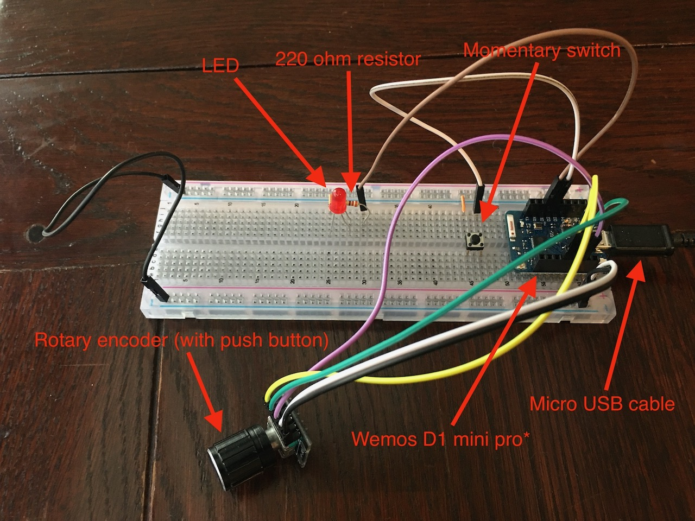
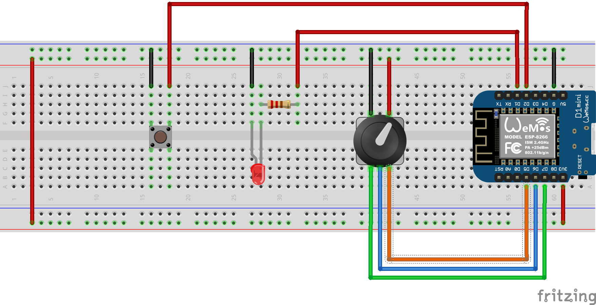

# smart-dimmer

**IN DEVELOPMENT**

Arduino ESP8266 smart dimmer implementation

**NB. A note on my `Wemos D1 mini pro` board**

My Wemos board seems to not be to spec as it only has 4MB flash memory instead of 16MB. As such I program it as a `LOLIN(WEMOS) D1 R2 & mini` through the Arduino IDE and CLI. If your board is to the correct spec then you may be able to use the `LOLIN(WEMOS) D1 mini pro` option. If you do this then the `FQBN` in the `makefile` will also need to be changed from `esp8266:esp8266:d1_mini` to `esp8266:esp8266:d1_mini_pro`

## Components



- Wemos D1 mini pro* (see note)
- KY-040 Rotary Encoder (with push button)
- LED
- 220 ohm resistor
- Momentary switch
- Micro USB cable
- Breadboard and jumper cables :)

## Wiring



Rotary encoder pins should be connected to the Wemos as follows:

- CLK (Pin A) -> D5 (Orange)
- DT (Pin B) -> D6 (Blue)
- SW (switch) -> D7 (Green)

## Programming the Wemos D1 mini pro*

Both the Arduino IDE and Arduino CLI are used to program the board. To use the Arduino IDE open the main sketch file at `sketch/sketch.ino`.

### Prequisites

Connect the Wemos board to your computer with the micro USB cable.

The serial device may be determined by running the following:

```
ls /dev/cu.*
```

The makefiles and shell scripts have been written for macOS Catalina (10.15.4). If using a different platform then they will likely need tweaking at the very least.

These are the Arduino versions currently used, other versions may work

- Arduino IDE 1.8.12 - https://www.arduino.cc/en/Main/Software
- Arduino CLI 0.10.0 - https://github.com/arduino/arduino-cli

Additionally you will need to install the following:

- `esp8266` package for Arduino (currently version 2.7.1)
  - Add `https://arduino.esp8266.com/stable/package_esp8266com_index.json` to `Additional Boards Manager URLs` in Arduino IDE `preferences`
  - Go to `Tools/Board/Boards Manager...` and install the `esp8266` package
- ArduinoJson (currently version 6.15.2) - https://arduinojson.org/
  - Go to `Tools/Manage libraries...` and install through the `Library Manager`
- CRC32 (currently version 2.0.0) - https://github.com/bakercp/CRC32
  - Go to `Tools/Manage libraries...` and install through the `Library Manager`
- ESP8266LittleFS plugin for Arduino (currently version 2.6.0)
  - Download from https://github.com/earlephilhower/arduino-esp8266littlefs-plugin/releases
  - Unzip to `~/Documents/Arduino/tools`

### Flashing the LittleFS file system

The `sketch/data` directory contains files that are required at run time and need to be flashed onto the board.

**NB. Doing this will remove any existing files (eg. modified config files)**

The Arduino IDE should be used to flash the LittleFS file system.

- Set `Tools/Board` to `LOLIN(WEMOS) D1 R2 & mini` (see note)
- Set `Tools/Port` to the correct serial port for your board
- Select `Tools/ESP8266 LittleFS Data Upload`

### Flashing the firmware

This can be done with either the Arduino IDE or Arduino CLI

With the IDE:

- Set `Tools/Board` to `LOLIN(WEMOS) D1 R2 & mini` (see note)
- Set `Tools/Port` to the correct serial port for your board
- Select `Sketch/Upload`

With the CLI:

- Run the following `arduino-cli` commands (see note with regard to FQBN)

```
arduino-cli compile --fqbn esp8266:esp8266:d1_mini sketch
arduino-cli upload -p <SERIAL_DEVICE> --fqbn esp8266:esp8266:d1_mini sketch
```

## Listening to the serial output

The serial output can be read using the Arduino IDE `Tools/Serial Monitor` or with other software such as `Minicom`. The baudrate should be set to `115200`.

Alternatively a shell script is provided to print the output to the terminal by running:

```
./listen.sh <SERIAL_DEVICE> 115200
```

Stop the script using `CTRL-C`

## Using the `makefile`

During development it is easier to use the `makefile` to compile and upload the firmware, etc (but not to upload the LittleFS file system at this time).

Before using the `makefile` you must create a `local.mk` file in the root of the project to contain your local settings. At a minimum it should contain the following:

```
SERIAL_DEVICE=<YOUR_SERIAL_DEVICE>
```

The make targets available are:

- `make all` - `compile`, `upload` then `listen`
- `make upload` - `compile` then upload the sketch
- `make compile` - compiles the sketch
- `make listen` - runs `listen.sh` to listen for output
- `make clean`- removes the compiled outputs

Defaults are specified in the `makefile` but the following variables can also be set (either in `local.mk` or at the command line:

- `SERIAL_DEVICE` - should set this to the path to your serial device (only used by `all`, `upload` and `listen`)
- `UPLOAD_FLAGS` - optionally specify additional flags for the upload. Eg: `UPLOAD_FLAGS=wipe=all` will clear the sketch, EEPROM and file system before uploading (only used by `all` and `upload`)
- `FQBN` - normally this should not be changed but see note on board selection
- `BAUDRATE` - normally this should not be changed but is the baudrate used when listening to serial output with `listen`
- `SKETCH` - should leave to the default of `sketch` as that is the folder and filename for the sketch
