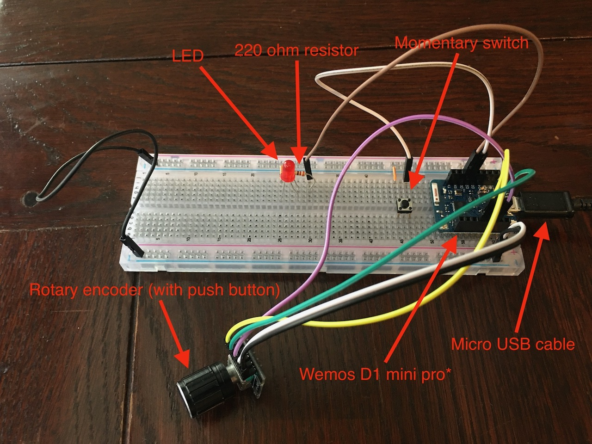
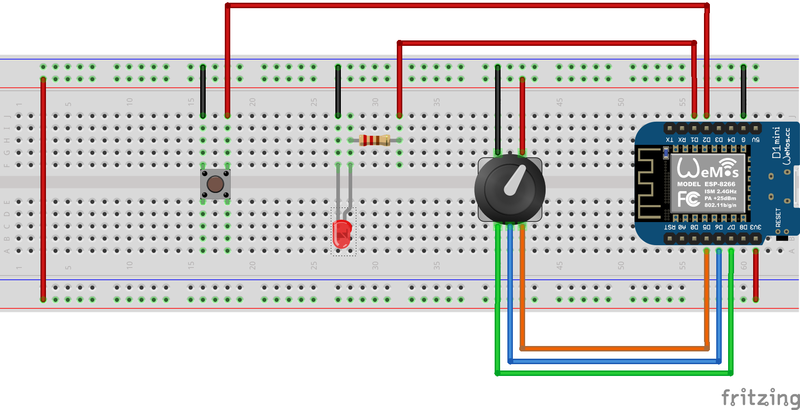

# burp-dimmer

**IN DEVELOPMENT**

ESP8266 smart dimmer implementation

**NB. Clone recursively to get submodules**

**NB. A note on my `Wemos D1 mini pro` board**

My Wemos board seems to not be to spec as it only has 4MB flash memory instead of 16MB. As such I program it as a `d1_mini` platformio. If your board is to the correct spec then you may be able to use the `d1_mini_pro` option.

## Components



- Wemos D1 mini pro* (see note)
- KY-040 Rotary Encoder (with push button)
- LED
- 220 ohm resistor
- Momentary switch
- Micro USB cable
- Breadboard and jumper cables :)

## Wiring



Rotary encoder pins should be connected to the Wemos as follows:

- CLK (Pin A) -> D5 (Orange)
- DT (Pin B) -> D6 (Blue)
- SW (switch) -> D7 (Green)

### Prequisites

Connect the Wemos board to your computer with the micro USB cable.

This is the PlatformIO version currently being used:

- PlatformIO Core 4.3.4 - https://docs.platformio.org/en/latest/core/installation.html

### Flashing the SPIFFS file system

The `sketch/data` directory contains files that are required at run time and need to be flashed onto the board.

**NB. Doing this will remove any existing files (eg. modified config files)**

```
platformio run -t uploadfs
```

### Flashing the firmware

```
platformio run -t upload
```

## Listening to the serial output

```
platformio device monitor
```

Stop the monitor using `CTRL-C`

## Erasing the flash file system

**NB. this will remove the program, file system and any data stored in EEPROM (ie. the factory settings will reinitialize)**

```
platformio run -t erase
```

## Updating multiple boards in parallel

The `ports` scripts can be used to update multiple boards at the same time. It should be configured by creating a `ports/config.sh` file with the following contents:

```bash
# add ports to the bash array
LOCAL_PORTS=()
LOCAL_PORTS+=(/dev/cu.usbserial-XXXXXXXX)
LOCAL_PORTS+=(/dev/cu.usbserial-XXXXXXXX)
LOCAL_PORTS+=(/dev/cu.usbserial-XXXXXXXX)
LOCAL_PORTS+=(/dev/cu.usbserial-XXXXXXXX)
export LOCAL_PORTS

# index of the default port (board)
DEFAULT_PORT=0
export DEFAULT_PORT

# Baudrate to use for the monitor task
MONITOR_BAUDRATE=115200
export MONITOR_BAUDRATE
```

Then run with:

```
./ports/<TASK>
```

The following tasks are available:

- `upload` - build and upload the firmware
- `uploadfs` - build and upload the file system
- `monitor` - monitor the serial ouput
- `erase` - erase flash memory
- `clean` - remove all local log files
- `default` - echos the default port

The `upload`, `uploadfs` and `monitor` tasks append their output to local log files.

The `default` task can be used to specify the default port in other commands, eg:

```
platformio run -t uploadfs --upload-port $(./ports/default)
platformio run -t upload --upload-port $(./ports/default)
platformio device monitor -p $(./ports/default)
```

## `tmux` configuration

For those that use `tmux` a tmux configuration is available that creates windows and panes for editing code and tailing logs. It assumes that 4 ports have been configured under `ports`.

To start (or reattach):

```
./tmux/start
```

To stop:

```
./tmux/kill
```
